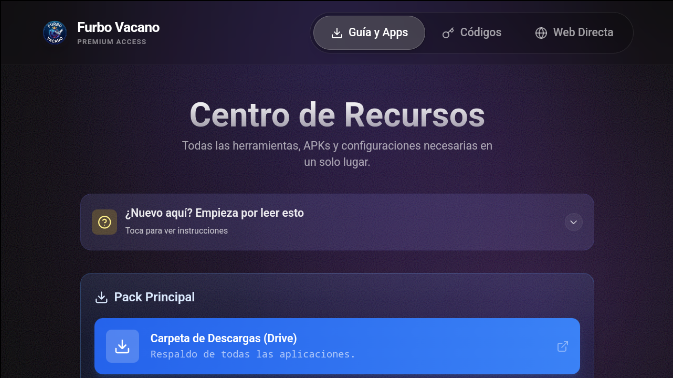
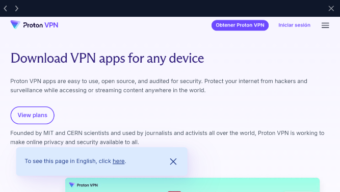
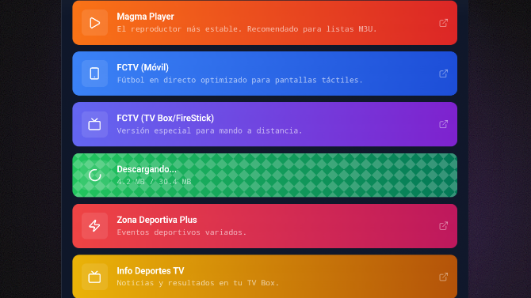

# ⚽ Furbo Vacano - TV Box Edition


> **El centro multimedia definitivo para Android TV.**
> Fútbol, Deportes y Herramientas en un solo lugar. Optimizado para mando a distancia.


---

## ⚡ Novedad: Tecnología FurboSync™

Esta aplicación cuenta con el sistema de actualización en la nube **FurboSync™**.

* **Siempre Actualizado:** Olvídate de descargar una nueva versión de la App cada vez que un enlace de fútbol deja de funcionar.
* **Gestión Remota:** Si cambia una lista de canales, una URL de Acestream o sale una mejora, la App se actualiza sola al abrirse.
* **Modo Offline:** Si se cae internet o GitHub, el sistema cuenta con una copia de seguridad local para seguir funcionando.

---

## 📺 ¿Qué es Furbo Vacano?

**Furbo Vacano** es una aplicación nativa para Android TV diseñada para simplificar el acceso a contenido deportivo. Olvídate de navegar por webs llenas de publicidad en tu televisor o de buscar APKs imposibles con el mando.

Esta app actúa como un **Lanzador Inteligente**: detecta las herramientas que necesitas (reproductores, AceStream, VPNs), las abre si las tienes, o te ayuda a descargarlas automáticamente si te faltan.

## ✨ Características Principales

* **🎮 Optimizado para TV:** Interfaz navegable 100% con mando a distancia (D-Pad), sin necesidad de ratón.
* **🧠 Smart App Detection:**
    * ¿Tienes *Acestream* instalado? → Lo abre automáticamente.
    * ¿No lo tienes? → Inicia la descarga e instalación.
* **🌐 Navegador "Anti-Frustración":**
    * Navegación web limpia dentro de la app.
    * **Interceptor de Enlaces:** Detecta automáticamente enlaces `acestream://` o `magnet:` y lanza el reproductor externo sin errores.
* **📥 Instalador de APKs:** Descarga e instala aplicaciones y herramientas directamente desde la App con barra de progreso.
* **💎 Diseño Premium:** Modo oscuro, Glassmorphism y animaciones fluidas.

## 📸 Capturas de Pantalla

| Menú Principal | Navegador Integrado | Instalador APK |
|:---:|:---:|:---:|
|  |  |  |

*(Las capturas muestran la interfaz adaptada a TV)*

## 🚀 Instalación (Para Usuarios)

1.  Ve a la sección **[Releases](https://github.com/Tomascabfer4/FurboVacano/releases)** de este repositorio.
2.  Descarga el último archivo `.apk` disponible.
3.  Pásalo a tu TV Box (vía USB o usando la app "Send Files to TV").
4.  Instala el APK y ¡a disfrutar!

> **Nota:** Necesitas aceptar la instalación de "Orígenes desconocidos" en tu dispositivo Android TV.

## 🛠️ Desarrollo (Para Programadores)

Si quieres compilar la app tú mismo o contribuir:

### Requisitos
* Node.js 18+
* Android Studio (con SDK de Android configurado)

### Pasos
1.  Clonar el repositorio:
    ```bash
    git clone [https://github.com/Tomascabfer4/FurboVacano.git](https://github.com/Tomascabfer4/FurboVacano.git)
    cd FurboVacano
    ```
2.  Instalar dependencias:
    ```bash
    npm install
    ```
3.  Sincronizar con Capacitor:
    ```bash
    npm run build
    npx cap sync
    ```
4.  Abrir en Android Studio y compilar:
    ```bash
    npx cap open android
    ```

## 🧱 Tecnologías Usadas

* **Frontend:** React + Vite + Tailwind CSS + Framer Motion
* **Core:** Capacitor 6
* **Backend:** FurboSync (JSON Remote Config via GitHub)
* **Plugins Clave:**
    * `cordova-plugin-inappbrowser`: Para la navegación web controlada.
    * `cordova-plugin-app-launcher`: Para detectar y abrir apps externas.
    * `capacitor-community/file-opener`: Para instalar APKs.

## ⚠️ Aviso Legal (Disclaimer)

Esta aplicación es un **gestor de enlaces y herramientas**. 
* **No aloja** ningún contenido protegido por derechos de autor en sus servidores.
* **No distribuye** señales de vídeo propias.
* Todos los enlaces son externos y responsabilidad de sus creadores.
* El usuario es responsable del uso que haga de las herramientas proporcionadas.

---
Hecho con ⚽ y ❤️ por **Tomás Cabello Fernández** | Powered by **FurboSync™**